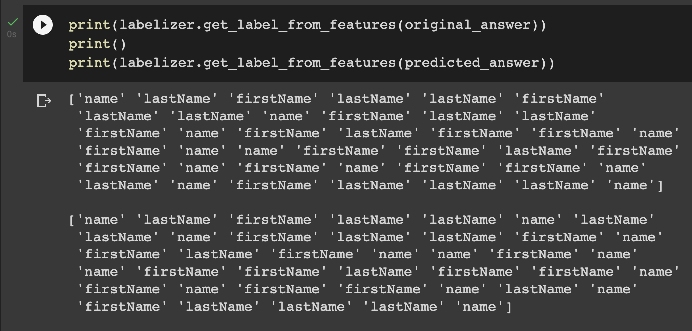

# Metadata-Day-2022-Hackathon
This repository holds the source code for Metadata Day 2022 Hackathon submission.

## Team
- [Shrey Batra](shbatra@linkedin.com)
- [Chanakya Komatireddy](ckomatireddy@linkedin.com)
- [Rajat Gupta](rajagupta@linkedin.com)

## Abstract
Today, DH users should manually add Glossary for schema fields in DH UI. These user annotations can be learnt to automate Glossary annotations on new entities in DH. This will save multiple hours per week/month for DH users by avoiding explicitly annotating the fields
   
## Background
Often, teams have a good naming convention while naming the datasets and their fields. When data is onboarded for a particular Platform on DH, it typically contains the data from multiple teams. If we can group all entities belonging to a specific team, we can train an ML model that can auto-annotate the Glossary for each schema field.
   
## Features
- ML Model training:
  - We developed an ML model that takes a golden records of Dataset fields -> Glossary annotations as a CSV. This CSV will contain “URN, Name, DataType & Glossary” fields.
  - Feature Generation
    - Name --> TF/IDF scores for N-grams are generated as features for Name of entity. We experimented multiple values for N and identified (3,4) grams are best features.
    - DataType --> OneHotEncoding is used to generate feature for this as this is an ENUM
  - Training: We experimented with multiple ML models. SVC and AdaBoost are giving good results for this.
- ML Model Serving:
  - The model will take a CSV containing URN, Name, DataType and will output a CSV containing Glossary field for each URN.

## Results

## Future Scope
1) Entity Grouping -> Module to group entities belonging to same team. API to read this content and feed it to the Model.
2) Update Glossary in DH --> Output of ML model is read to update it directly in DH
3) Add more features --> We can experiment other features to generate from properties of Dataset fields
